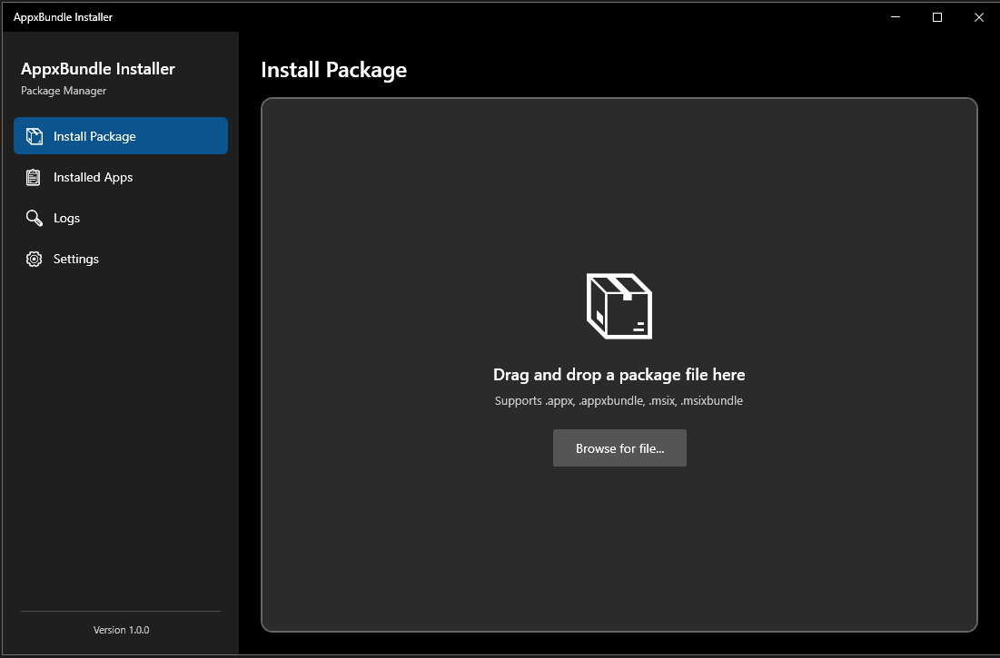
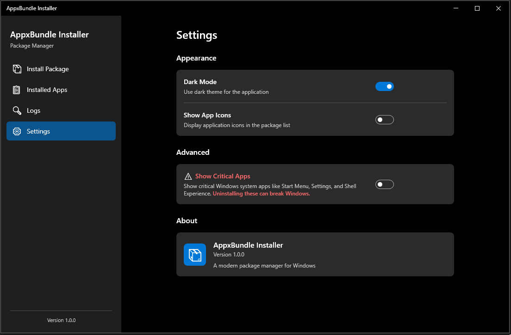

# AppxBundle Installer

A lightweight, modern Windows desktop application for managing Appx, AppxBundle, MSIX, and MSIXBundle packages. Built with .NET 8 and WPF, featuring a Fluent Design interface.


<details>
<summary><b>📸 Screenshots (Click to Expand)</b></summary>
<br>

### Main Dashboard


### Package Management


### Settings & Logs


</details>

## ✨ Features

### 📦 Smart Package Installation
- **Drag & Drop Support**: Simply drag `.appx`, `.appxbundle`, `.msix`, or `.msixbundle` files to install.
- **Pre-Install Validation**: Automatically checks file integrity, architecture compatibility, and signature status before installation prevents errors.
- **Detailed Metadata**: Views package display names, versions, publisher info, and capabilities.
- **Real-Time Progress**: Visual feedback during the installation process.

### 📋 Installed Apps Management
- **Centralized Library**: View all Appx/MSIX packages installed on your system in one clean list.
- **Advanced Filtering**: Filter by "User Installed", "System/Framework", or "Microsoft" apps.
- **Search**: Instantly find packages by Name, PackageFamilyName, or Publisher.
- **Safe Uninstallation**: Uninstall apps with built-in protections against removing critical system packages.

### 🛡️ Security & Privacy
- **Critical App Protection**: Prevents accidental removal of system-critical apps (e.g., ShellExperienceHost, StartMenu).
- **Diagnostics**: Comprehensive logging system for troubleshooting installation failures.
- **Privacy Focused**: No telemetry, no ads, no background services.

### 🎨 Modern Experience
- **Fluent Design**: Native Windows 11 aesthetics with Mica/Acrylic effects.
- **Theme Support**: Seamlessly switches between Light and Dark modes based on system settings.
- **Responsive**: Adaptive layout that works on various window sizes.

---

## 💻 prerequisites

To run or build the application, ensure your system meets the following requirements:

### System Requirements
- **OS**: Windows 10 (Version 1809, Build 17763 or later) or Windows 11.
- **Architecture**: x64 or ARM64.
- **Developer Mode**: Recommended for installing unsigned packages (Settings -> Update & Security -> For developers).

---

## 🛠️ Building the Project

This project is built using **.NET 8 (Desktop)**. Follow these steps to set up your environment and compile the application.

### 1. Developer Environment
Ensure you have the following installed:
- [Visual Studio 2022](https://visualstudio.microsoft.com/downloads/) (Community, Professional, or Enterprise)
- **Workload required**: ".NET Desktop Development"
- **Individual Component**: "Windows 10 SDK (10.0.19041.0)" or later.

### 2. Clone & Restore
```powershell
# Clone the repository
git clone https://github.com/jdros15/AppxBundle-Installer.git
cd "AppxBundle Installer"

# Restore NuGet packages
dotnet restore
```

### 3. Development Build
For quick testing and debugging:
```powershell
dotnet run --project AppxBundleInstaller
```

### 4. 🚀 Optimized Production Build (Important)
To create a standalone executabe that is **optimized for size** (avoiding the 250MB+ bloat of standard self-contained builds), use the following command. 

This command enables **Single File** publishing and **Compression**, which drastically reduces the final `.exe` size (typically ~60-80MB for a fully self-contained app).

# Publish optimized standalone executable
dotnet publish AppxBundleInstaller/AppxBundleInstaller.csproj `
    -c Release `
    -r win-x64 `
    --self-contained true `
    -p:PublishSingleFile=true `
    -p:EnableCompressionInSingleFile=true `
    -p:DebugType=embedded `
    -p:IncludeNativeLibrariesForSelfExtract=true

**Output Location**:  
`AppxBundleInstaller/bin/Release/net8.0-windows10.0.19041.0/win-x64/publish/`

> **Note**: The resulting `.exe` includes the .NET Runtime, so users **do not** need to install .NET manually.

---

## 🔧 Troubleshooting

### Common Installation Errors

| Error Code | Helper Text | Solution |
|------------|-------------|----------|
| `0x800B0100` | No Signature | Enable **Developer Mode** in Windows Settings or sign the package with a trusted certificate. |
| `0x80073CF3` | Dependency Error | The package depends on a framework (e.g., VCLibs) that is missing. Install dependencies first. |
| `0x80070005` | Access Denied | Run the installer as Administrator or check if Group Policies block sideloading. |
| `0x80073CFF` | License Issue | A valid license is required for this app or side-loading is disabled. |

### Diagnostics
If the application behaves unexpectedly, navigate to the **Logs** (or Diagnostics) tab. You can export the logs to a text file for analysis.

---

## 🏗️ Architecture

The solution follows a standard MVVM (Model-View-ViewModel) pattern tailored for WPF:

- **`Views/`**: XAML UI definitions (MainWindow, InstallView, SettingsView).
- **`ViewModels/`**: Logic bindings (InstallViewModel, AppListViewModel).
- **`Services/`**: Core logic (PackageManager, Elevation, Logging).
  - `PackageManagerService.cs`: Wraps functionality around `Windows.Management.Deployment`.
  - `PackageValidationService.cs`: Validates file headers and manifests.
- **`Models/`**: Data structures (PackageInfo, LogEntry).

## 📄 License

This project is licensed under the [MIT License](LICENSE). Feel free to use, modify, and distribute.
